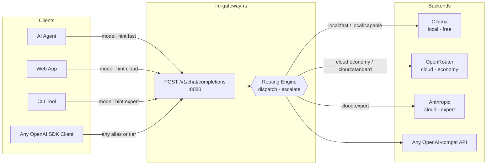

# LM Gateway RS

> **Ultra-lightweight LLM routing gateway written in Rust.**  
> Single binary. No Python. No database. No bloat.

[](LICENSE)
[](https://www.rust-lang.org)

---

## What it does

LM Gateway RS sits between your application and your LLM backends, providing a unified OpenAI-compatible interface across any number of local or cloud models. It handles credential management, tier-based routing, and intelligent escalation — so your application stays simple.



---

## Why not LiteLLM?

LiteLLM is the most common answer to this problem. It has 100+ provider integrations and a large community. It is also:

- **Python** — large runtime, complex dependency tree, slow cold start
- **Database-backed** — requires SQLite or Postgres for anything beyond basic routing
- **Drifting SaaS-ward** — the Enterprise tier adds cost and cloud surface you don't need

LM Gateway RS is the alternative when you want something that:

- Ships as a **single static binary** (`docker run` and done)
- Has **zero external runtime dependencies**
- Fits on a **Raspberry Pi or a $5 VPS**
- Can be **audited in an afternoon** (< 2 000 lines of Rust)
- Is **100% self-hosted** with no telemetry, no cloud account required

---

## Features

- **OpenAI-compatible API** — drop-in replacement endpoint for any client that speaks `/v1/chat/completions`
- **Tier ladder** — define a cheapest→best progression of models, from local Ollama to cloud experts
- **Two routing modes:**
  - **Dispatch** — classify intent with a fast local model, forward to the right tier immediately (predictable latency)
  - **Escalate** — try cheapest tier first; evaluate response quality; escalate only if needed (lowest average cost)
- **Centralised credential management** — backends reference env vars; clients need no API keys
- **Live admin UI** — dark dashboard at `:8081` with real-time traffic log, backend health, and config view
- **In-memory traffic log** — ring-buffer; zero disk I/O, bounded memory, works on read-only filesystems

---

## Quick start

```bash
# 1. Copy and edit the example config
cp config.example.toml config.toml
$EDITOR config.toml

# 2. Set secrets via environment variables (never in the config file)
export OPENROUTER_KEY="sk-or-..."

# 3. Run
docker run --rm \
  -v $(pwd)/config.toml:/etc/lm-gateway/config.toml:ro \
  -e OPENROUTER_KEY \
  -p 8080:8080 -p 8081:8081 \
  lm-gateway:latest
```

Then send a request:

```bash
curl http://localhost:8080/v1/chat/completions \
  -H "Content-Type: application/json" \
  -d '{"model":"hint:fast","messages":[{"role":"user","content":"Hello"}]}'
```

Open the admin UI: `http://localhost:8081/`

---

## Client API (port 8080)

| Method | Path | Description |
| ------ | ---- | ----------- |
| `POST` | `/v1/chat/completions` | Route a chat request |
| `GET` | `/v1/models` | List available tiers and aliases |
| `GET` | `/healthz` | Liveness probe |

Use any tier name or alias as the `model` field:

```json
{
  "model": "hint:fast",
  "messages": [{ "role": "user", "content": "Hello" }]
}
```

Built-in aliases: `hint:fast`, `hint:cheap`, `hint:local`, `hint:cloud`, `hint:standard`, `hint:expert`

---

## Admin API (port 8081)

| Method | Path | Description |
| ------ | ---- | ----------- |
| `GET` | `/` | Admin dashboard (web UI) |
| `GET` | `/admin/health` | Gateway health + tier/backend counts |
| `GET` | `/admin/traffic?limit=N` | Recent N requests + aggregate stats |
| `GET` | `/admin/config` | Running config (secrets redacted) |
| `GET` | `/admin/backends/health` | Probe all configured backends |

---

## Configuration

See [config.example.toml](config.example.toml) for a fully annotated example. A typical setup is under 50 lines.

**Key concepts:**

| Concept | What it is |
| ------- | ---------- |
| **Backend** | A named LLM provider — base URL + optional secret env var |
| **Tier** | A named (backend, model) pair in cheapest→best order |
| **Alias** | Short name like `hint:fast` that resolves to a tier |
| **Profile** | Routing behaviour: mode, classifier tier, cost ceiling |

**Environment variable for config path:**

```bash
LMG_CONFIG=/path/to/config.toml   # default: /etc/lm-gateway/config.toml
```

---

## Use cases

- **Homelab / private LLM deployments** — route between local Ollama and cloud fallback
- **AI agent clusters** — serve multiple agents through a single credential-holding gateway
  - Works as-is with [ZeroClaw](https://github.com/zeroclaw-labs/zeroclaw) and any OpenAI-compatible agent framework
- **Cost optimisation** — escalate to expensive cloud models only when local models can't answer
- **Development environments** — keep all API keys in one place, share across projects

---

## Building

```bash
# Local development (uses platform TLS — schannel on Windows, OpenSSL on Linux)
cargo build

# Production Docker image
# Uses rustls (pure-Rust TLS, no OpenSSL) for a fully static binary.
# Cap RAM for low-memory hosts.
docker build --memory=3g --build-arg CARGO_BUILD_JOBS=2 -t lm-gateway .
```

The release binary is statically linked and has no runtime dependencies beyond libc.

---

## Project layout

```text
src/
├── main.rs          Startup, dual listeners, graceful shutdown
├── config.rs        Config types, TOML loading, validation
├── router.rs        Routing logic (dispatch + escalate modes)
├── traffic.rs       In-memory ring-buffer traffic log
├── error.rs         Unified error type
├── backends/
│   ├── mod.rs       BackendClient enum dispatcher
│   ├── openai.rs    OpenAI / OpenAI-compatible passthrough
│   ├── ollama.rs    Ollama adapter (keyless)
│   └── anthropic.rs Anthropic schema translation
└── api/
    ├── mod.rs       Router assembly
    ├── health.rs    GET /healthz
    ├── client.rs    POST /v1/chat/completions, GET /v1/models
    ├── admin.rs     Admin endpoints
    └── admin_ui.html Single-page admin dashboard
```

---

## Design principles

- **One job** — route LLM traffic. Nothing else.
- **No magic** — config is a single TOML file; behaviour is deterministic and auditable.
- **Small surface** — no database, no agent, no scheduler. A process that starts fast and uses < 10 MB RAM at idle.
- **Transparent** — config endpoint redacts secrets; traffic log captures routing decisions.
- **Upstream-friendly** — clean Rust, idiomatic error handling, documented public API surface.

---

## License

MIT — see [LICENSE](LICENSE).
